<h1>Event Rideshare</h1>

Zero-dependency, self-hosted ride-sharing platform for conference attendees.

<br clear="left">

[](https://github.com/dcondrey/rideshare/actions/workflows/ci.yml)
[](https://github.com/dcondrey/rideshare/actions/workflows/codeql.yml)
[](https://github.com/dcondrey/rideshare/blob/main/LICENSE)
[](https://www.bestpractices.dev/projects/14407)
[](https://rideshare-demo.onrender.com)
[](https://nodejs.org/)
[](./package.json)
[](https://github.com/dcondrey/rideshare/commits/main)
[](https://biomejs.dev)

[](https://www.w3.org/TR/vc-data-model-2.0/)
[](https://www.w3.org/TR/did-core/)
[](https://www.rfc-editor.org/rfc/rfc9901)
[](https://openid.net/specs/openid-4-verifiable-credential-issuance-1_0.html)
[](https://openid.net/specs/openid-4-verifiable-presentations-1_0.html)
[](https://identity.foundation/didcomm-messaging/spec/v2.1/)

<p align="center">
  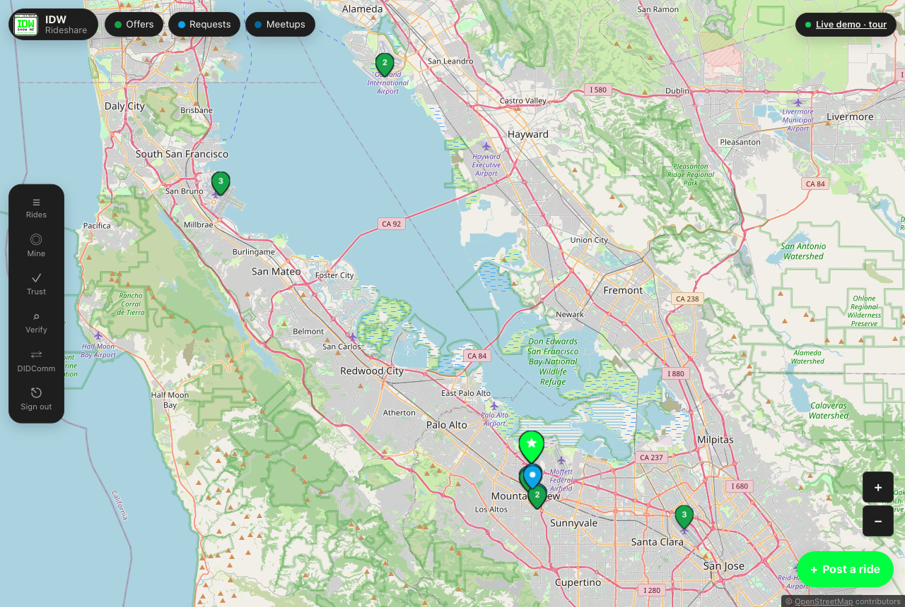
</p>

A ride board for conference attendees that doubles as a working reference for DIDs and W3C Verifiable Credentials in an ordinary product.

Each deployment is its own `did:web` issuer. Each attendee holds a `did:key` generated in their browser. When two people confirm they shared a ride, both get a signed `RideAttendanceCredential` they can export, carry to the next event and verify anywhere.

No central registry, no wallet vendor, no npm dependencies. The trust layer is plain JavaScript on Node's built-in `crypto` and the browser's WebCrypto.

## Try the live demo

[rideshare-demo.onrender.com](https://rideshare-demo.onrender.com), issuer `did:web:rideshare-demo.onrender.com`.

It runs on Render's free plan. The first request after a quiet spell can take a minute while it wakes, and every wake-up starts a fresh demo.

The demo plays the Internet Demo Workshop (IDW), a fictional unconference modeled on the Internet Identity Workshop ("Show me, don't tell me": no slide decks, bugs are celebrated). Sign-in is one click:

| Account | Email | What you can do |
|---|---|---|
| Attendee | `attendee@demo.test` | Your own sandbox: post rides, claim seats, create a DID, earn and verify a credential |
| Organizer | `organizer@demo.test` | Admin dashboard, insights, allowlist, config and audit log, read-only |

Everyone else is a synthetic attendee. They post rides, ask for seats on yours, accept your claims within a minute and confirm shared rides, so you can run the whole flow alone:

1. Create your DID. The browser generates an Ed25519 `did:key` with WebCrypto, keeps the private key in IndexedDB, and proves control by signing a one-time server challenge.
2. Confirm a ride. You start with an accepted seat in a synthetic driver's car. The driver has already confirmed, so your confirmation completes the pair.
3. Hold a credential. Both sides get a VC-JWT signed by the event's `did:web` key.
4. Verify it at `/trust/verify`, or in any VC-JWT tool that resolves `did:web`.

The tour's "Go further" steps: reveal only some claims from the SD-JWT VC copy, send the credential to a wallet over OpenID4VCI, verify someone over OpenID4VP from `/verify`, and ping another event's DIDComm agent from `/trust/didcomm`.

<table>
  <tr>
    <td width="50%">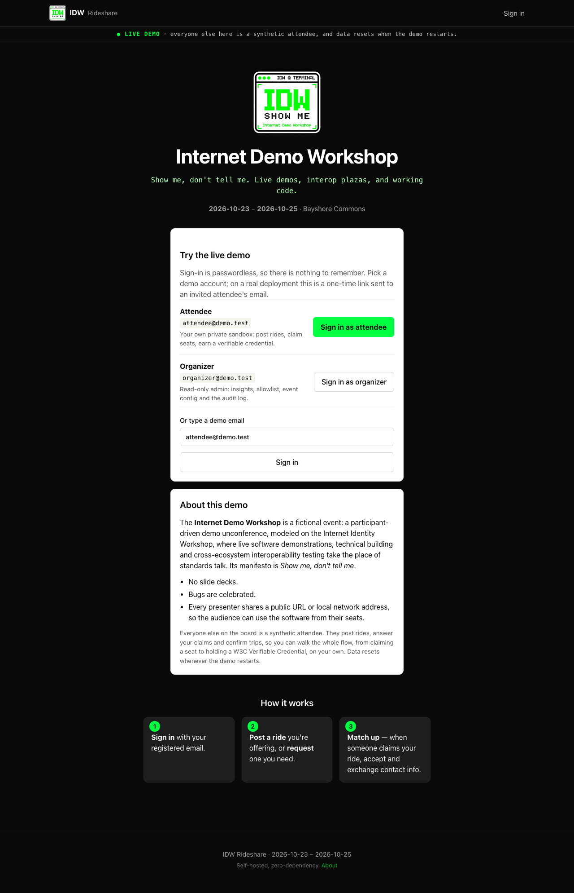</td>
    <td width="50%">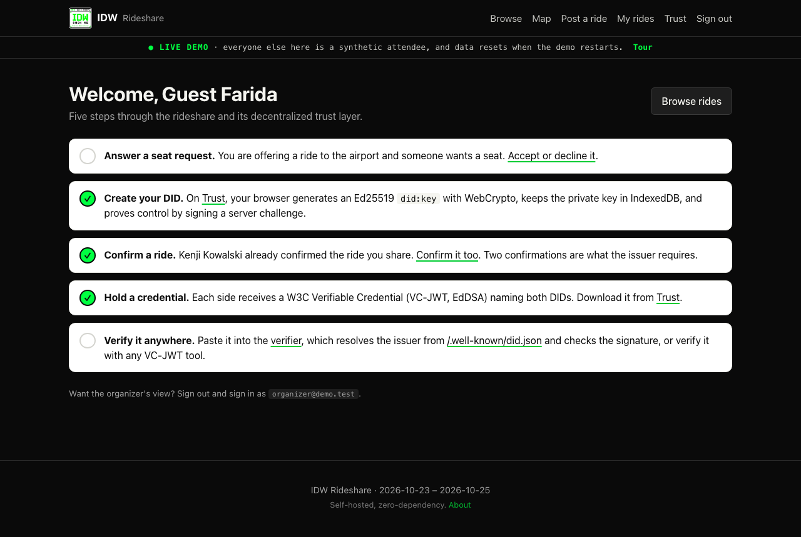</td>
  </tr>
  <tr>
    <td>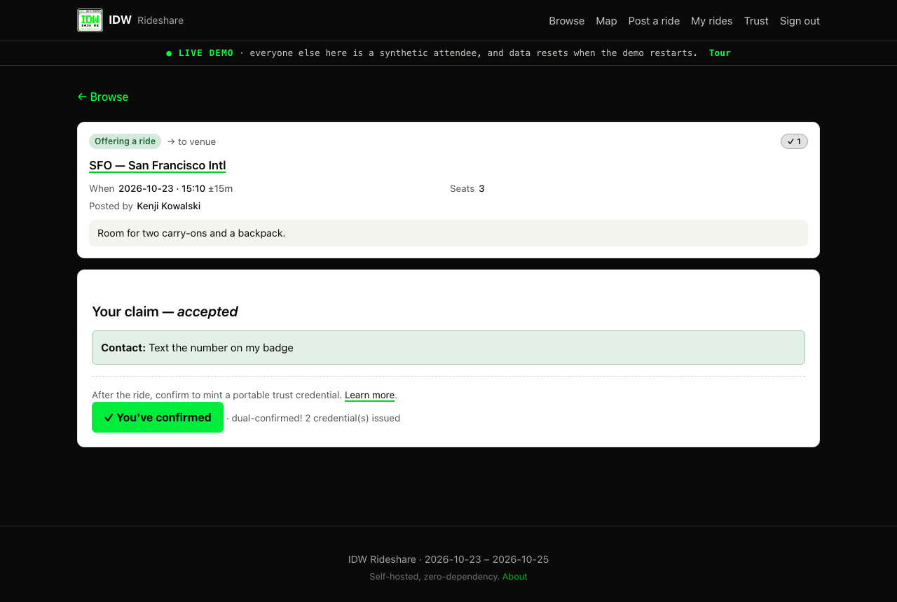</td>
    <td>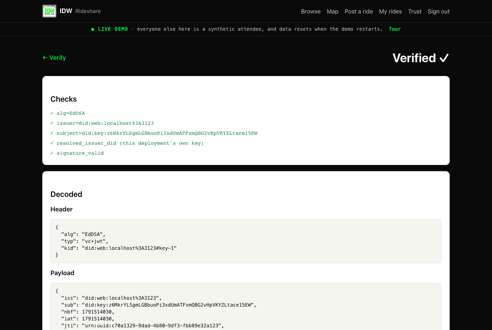</td>
  </tr>
</table>

Run the demo locally. It uses its own database file, so it can't touch real data:

```bash
APP_URL=http://localhost:3000 \
SESSION_SECRET=$(openssl rand -hex 32) ALLOWLIST_SALT=$(openssl rand -hex 32) \
DEMO_MODE=true EVENT_CONFIG=event.config.demo.yaml \
DATABASE_PATH=./data/demo.db DEPLOYMENT_KEY_PATH=./data/demo.key \
npm start
```

To host your own copy, see [Render](#render) below. `DEMO_MODE` opens sign-in to anyone, refuses to start against a database with real attendees, and makes the organizer account read-only. Never set it on a real event.

---

## For the decentralized identity crowd

### Identifiers

| Party | DID method | Keys | Where it lives |
|---|---|---|---|
| Deployment (issuer, verifier, DIDComm agent) | [`did:web`](https://w3c-ccg.github.io/did-method-web/) | Ed25519 `#key-1` (VC-JWT), P-256 `#key-2` (SD-JWT VC, OpenID4VP requests), X25519 `#key-x25519-1` (DIDComm key agreement), all `JsonWebKey2020` | Private key in a file outside the database (`DEPLOYMENT_KEY_PATH`, or inline `DEPLOYMENT_KEY`), so backups carry no issuer key. DID document at `/.well-known/did.json` |
| Attendee (holder, subject) | [`did:key`](https://w3c-ccg.github.io/did-method-key/) | Ed25519, multicodec `0xed01`, base58btc `z6Mk…` | Generated in the browser with WebCrypto, private key in IndexedDB. Downloadable as a JWK backup and restorable on another device |

The DID document also lists `keyAgreement`, `assertionMethod` (`#key-1`, `#key-2`), `authentication` (`#key-1`) and a `DIDCommMessaging` service at `https://<host>/didcomm` accepting `didcomm/v2`. Fetch it from the demo:

```bash
curl https://rideshare-demo.onrender.com/.well-known/did.json
```

Binding a DID to an account is challenge-response. The server issues a single-use, five-minute `rideshare-bind:<uuid>` challenge, the browser signs it with the `did:key`, and the server checks the Ed25519 signature before recording the binding.

### Credentials

Issuance needs dual confirmation: after the trip, the driver and the rider each tap "I made this ride". The deployment then signs one credential per side, naming the holder as subject and the other person as `counterpart`. If someone binds a DID after confirming, their credential is issued at bind time.

A decoded credential from a local run configured as the demo host (its key is gone, so read it, don't verify it):

```json
{ "alg": "EdDSA", "typ": "vc+jwt", "kid": "did:web:rideshare-demo.onrender.com#key-1" }
```

```json
{
  "iss": "did:web:rideshare-demo.onrender.com",
  "sub": "did:key:z6MkghGtr7XD79JpirJUSVenpeAAqL8YajmYCNPwVz1A5saB",
  "nbf": 1791513927,
  "iat": 1791513927,
  "jti": "urn:uuid:27abf7d7-ea5f-4d3d-8d13-c7a12b498228",
  "vc": {
    "@context": ["https://www.w3.org/ns/credentials/v2"],
    "id": "urn:uuid:27abf7d7-ea5f-4d3d-8d13-c7a12b498228",
    "type": ["VerifiableCredential", "RideAttendanceCredential"],
    "issuer": "did:web:rideshare-demo.onrender.com",
    "validFrom": "2026-10-09T02:45:27.395Z",
    "credentialSubject": {
      "id": "did:key:z6MkghGtr7XD79JpirJUSVenpeAAqL8YajmYCNPwVz1A5saB",
      "type": "RideParticipant",
      "role": "driver",
      "counterpart": "did:key:z6MkvEZ4r91r7cTr8bGxBj9ZsFjzQ4wynFp3BCFFnE4XEuAN",
      "ride": { "date": "2026-10-23", "time": "06:00", "airport": "OAK", "direction": "to_venue" },
      "event": { "name": "IDW", "startDate": "2026-10-23", "endDate": "2026-10-25" }
    }
  }
}
```

### Portability and verification

- Export credentials from `/trust` as JWTs or one JSON bundle, and import them on any other deployment.
- Import checks the subject is the importer's bound DID, resolves the issuer's `did:web` over an SSRF-hardened fetch (no private addresses, no redirects, size and time caps), verifies the EdDSA signature and `nbf`/`exp`, and re-verifies in the background so a rotated issuer key stops counting.
- Ride cards show how many confirmed rides a poster holds, across how many issuers, without revealing who they rode with.
- `/trust/verify` needs no account, accepts credentials from any deployment, and lists every check it ran.
- Credentials name the counterpart's DID, never their email or name.

### Standards, and exactly how closely they're followed

| Concern | Spec | Status |
|---|---|---|
| DID syntax and documents | [DID Core](https://www.w3.org/TR/did-core/) | Followed. `JsonWebKey2020` rather than Multikey, because didcomm-rust rejects documents containing Multikey |
| Issuer identifier | `did:web` | Followed for minting, including `%3A` port encoding. **Deviation:** resolution refuses any port other than 443 (SSRF guard), so another deployment can't verify a `did:web:host%3A8443` issuer. A deployment verifies its own credentials against its local key, no network round trip |
| Holder identifier | `did:key` (Ed25519) | Followed. Encoding covered by `tests/unit/crypto-did-key.test.js` |
| Data model | [VC Data Model 2.0](https://www.w3.org/TR/vc-data-model-2.0/) | Followed: v2 context, `validFrom`. App terms resolve through the v2 context's `@vocab` |
| Securing | VC-JWT, EdDSA ([RFC 8032](https://www.rfc-editor.org/rfc/rfc8032)) | **Deviation:** VC-JWT 1.1 shape, credential in a `vc` claim next to `iss`/`sub`/`nbf`/`jti`, while the header says `typ: vc+jwt`, the [VC-JOSE-COSE](https://www.w3.org/TR/vc-jose-cose/) media type, whose payload is the bare credential. A strict VC-JOSE-COSE verifier has to read the `vc` claim to accept these |
| Signatures | Ed25519, ES256 | Node's built-in `crypto`, checked against RFC 8032 test vectors. ES256 (P-256) signs SD-JWT VCs |
| Issuance to wallets | [OpenID4VCI 1.0](https://openid.net/specs/openid-4-verifiable-credential-issuance-1_0.html) | Pre-authorized code flow with a PIN, nonce endpoint, `jwt` proofs (ES256 or Ed25519), format `dc+sd-jwt`. Not implemented: authorization code flow, DPoP, key attestations, deferred issuance, so not HAIP |
| Messaging | [DIDComm v2.1](https://identity.foundation/didcomm-messaging/spec/v2.1/) | Authcrypt (`ECDH-1PU+A256KW`) and anoncrypt (`ECDH-ES+A256KW`) with `A256CBC-HS512` over X25519; Trust Ping 2.0 and Discover Features 2.0. Checked against the spec vector and didcomm-rust (packing both ways, plus a live agent round trip). Anoncrypt also accepts `A256GCM` and `XC20P` (XChaCha20 via a hand-written HChaCha20, checked against the draft's vector), so didcomm-rust's default works. Not implemented: signed (JWS) messages, mediators, forward routing |
| Presentation | [OpenID4VP 1.0](https://openid.net/specs/openid-4-verifiable-presentations-1_0.html) | `decentralized_identifier` client id with an ES256-signed request object by reference, DCQL, `direct_post`, `dc+sd-jwt` with key binding. Not implemented: `x509_hash`, `direct_post.jwt`, the Digital Credentials API |
| Selective disclosure | [SD-JWT, RFC 9901](https://www.rfc-editor.org/rfc/rfc9901) + [SD-JWT VC draft-19](https://datatracker.ietf.org/doc/draft-ietf-oauth-sd-jwt-vc/) | Followed. Every ride credential is also issued as a `dc+sd-jwt` bound to the holder's `did:key` via `cnf.jwk`; the holder picks claims on `/trust` and signs a KB-JWT with a verifier nonce. Tested against the RFC's digest vectors. Issuer keys at `/.well-known/jwt-vc-issuer`; `x5c` chains not supported |

### Selective disclosure

On `/trust` the holder ticks which claims of the SD-JWT VC twin to reveal (say `event.name` and `role`). The browser drops the other disclosures and signs a key-binding JWT with the `did:key` over a single-use verifier nonce.

`/trust/verify` checks the issuer signature, every digest, the key binding, `sd_hash` and the nonce, then shows what was revealed and how many digests stayed hidden (withheld claims and decoys look alike). Replays fail on the spent nonce.

### Issue to a wallet (OpenID4VCI)

"Add to a wallet" on `/trust` shows a QR code and a 6-digit PIN for a pre-authorized code offer. The wallet trades them for a token, fetches a `c_nonce`, proves its key with an `openid4vci-proof+jwt`, and gets an SD-JWT VC bound to that key.

Metadata: `/.well-known/openid-credential-issuer`, `/.well-known/oauth-authorization-server`. Codes, PINs, tokens and nonces are single-use and expire in minutes; five wrong PINs burn the offer. Strict HAIP wallets may refuse it.

### Verify a wallet (OpenID4VP)

`/verify` shows a request as a QR code. The client id is `decentralized_identifier:<this event's did:web>`, and the request object (`typ: oauth-authz-req+jwt`) is signed with the DID's ES256 key, so the wallet authenticates the verifier through the DID document.

The DCQL query asks for one ride credential, only `event.name` and `role`. The wallet answers by `direct_post`. Checks: issuer signature, key binding (`aud` must be the full client id), nonce, accepted `vct`, single use.

The browser holder on `/trust` can answer too: paste the `openid4vp://` link and the server verifies the request against the verifier's DID document before the browser sends the requested claims.

### Talk to other events (DIDComm)

Each `did:web` is also a DIDComm agent with a `DIDCommMessaging` service at `/didcomm`. From `/trust/didcomm`, send a Trust Ping or Discover Features query to any deployment's DID and watch the authenticated reply; ping your own DID to see the round trip on one server.

It interoperates with didcomm-rust, the engine of [@writerslogic/didcomm-ts](https://github.com/writerslogic/didcomm-ts). To rerun the checks:

```bash
npm i --no-save --no-package-lock didcomm@0.4.1
node tests/interop/didcomm-rust.mjs
# with a server running under ALLOW_INSECURE_DID_WEB=true:
RIDESHARE=http://localhost:3000 node tests/interop/didcomm-rust-agent.mjs
```

<table>
  <tr>
    <td width="50%">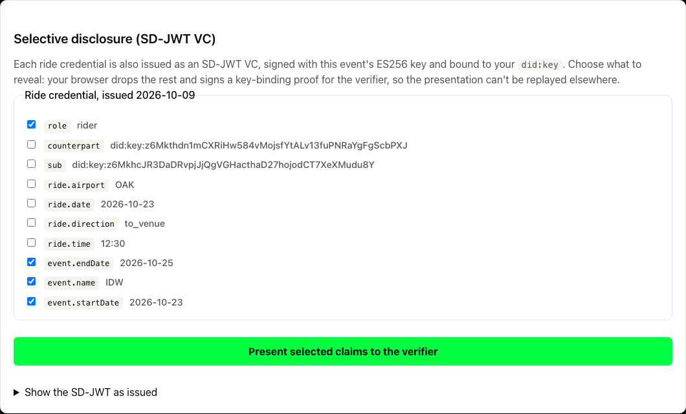</td>
    <td width="50%">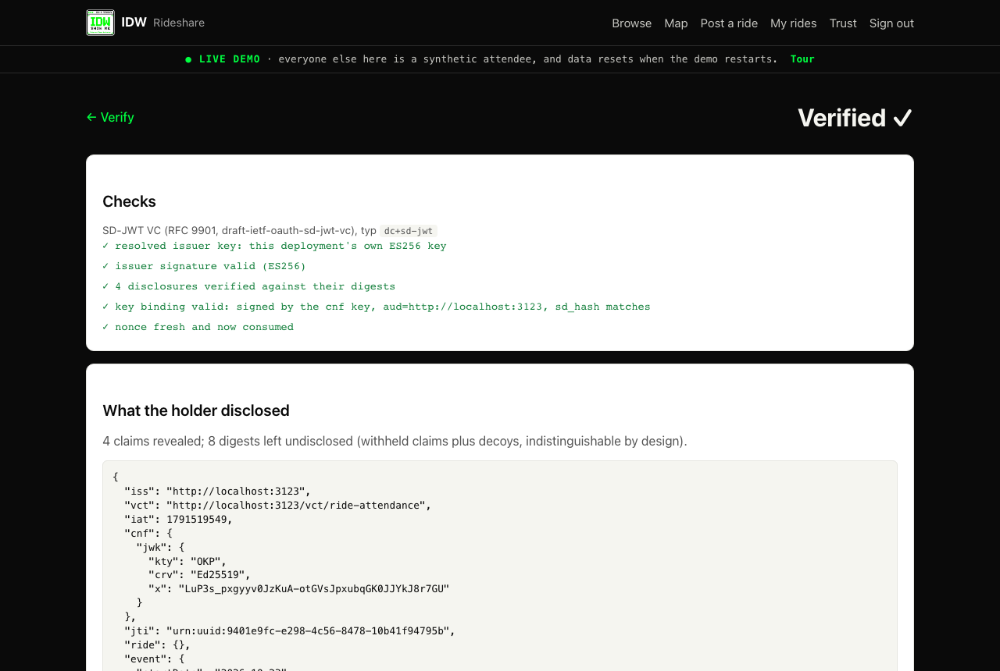</td>
  </tr>
  <tr>
    <td>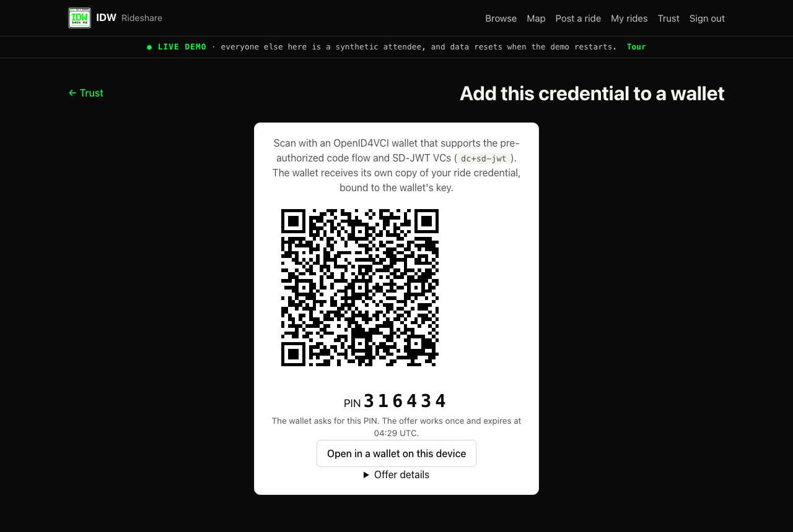</td>
    <td>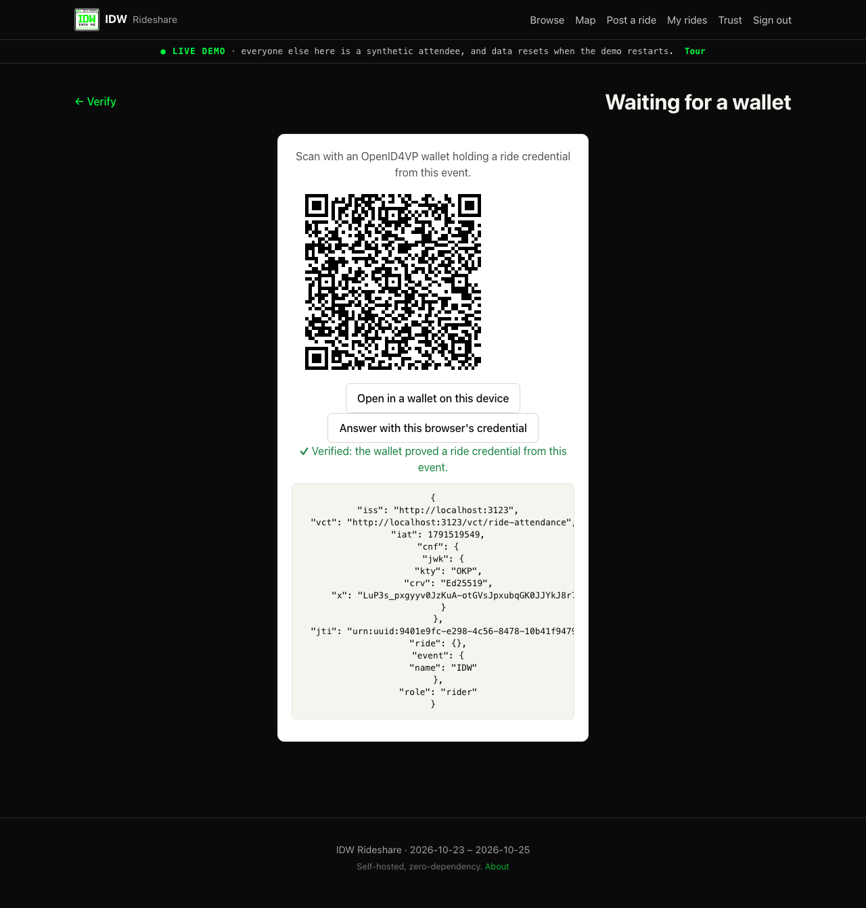</td>
  </tr>
  <tr>
    <td colspan="2">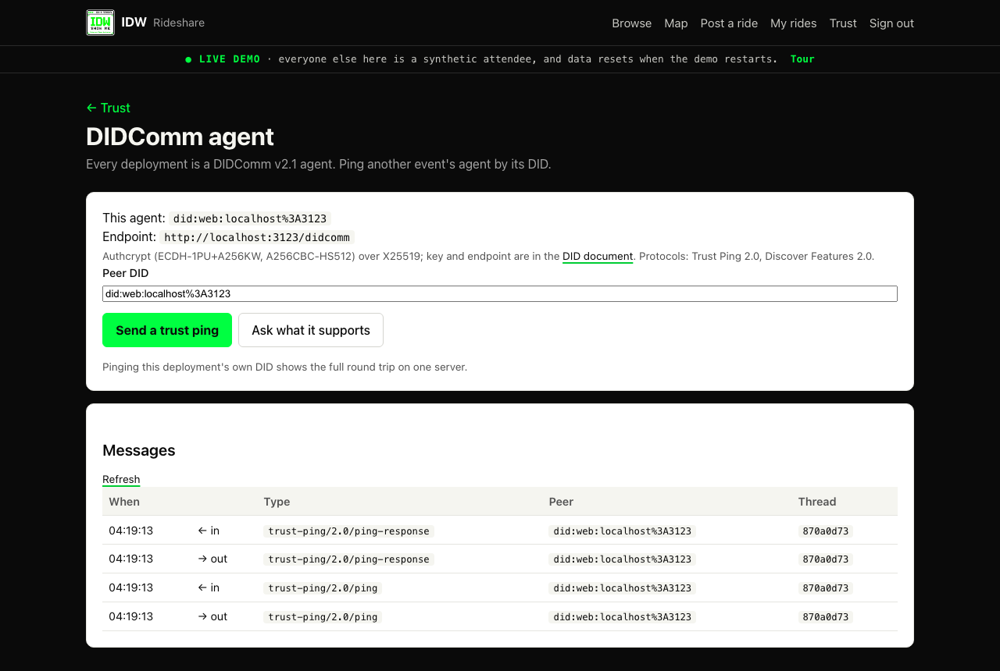</td>
  </tr>
</table>

### Gaps

No real wallet app has been tested yet. OpenID4VCI and OpenID4VP are verified with scripted wallets against the live demo; the OpenID Foundation conformance suite is next. Wallets without the `decentralized_identifier` client id prefix can't answer `/verify`.

Not implemented:

- Status lists or any revocation
- BBS proofs, Data Integrity proofs
- DIDComm credential exchange (issue-credential 3.0 and present-proof 3.0 define no SD-JWT format), signed messages, mediators
- HAIP conformance

Credentials carry no `exp`, and a deployment publishes a single Ed25519 key, so rotating it makes every earlier VC-JWT unverifiable. On the free-plan demo all keys regenerate on wake, so credentials and DIDComm peers from earlier sessions stop verifying.

The [TRUST.md](./TRUST.md) roadmap covers counter-signed credentials (the counterpart co-signs, so the event alone can't fabricate a ride), BBS+ proofs and status lists. Issues and patches welcome.

Protocol details, threat table and implementation file map: [TRUST.md](./TRUST.md). Forgery analysis: [docs/security/credential-forgery.md](./docs/security/credential-forgery.md).

---

## For event organizers

Attendees fly into the same airports on the same days and head to the same venue, and nobody coordinates. This gives you a private ride board you can stand up in minutes, brand for your event and delete when it's over.

- Attendees sign in with a passwordless magic link, if their email is on your allowlist.
- They post rides they're offering or requesting: airport, date, time, seats, notes, optional pickup pin.
- Others claim seats. When the poster accepts, both sides see each other's contact details.
- Organizers get an aggregate insights dashboard (engagement, match rates, unmet demand by airport and date, CSV export) with k-anonymity.

One Node process, one SQLite file, no build step, no `npm install`. Event name, dates, venue, airports, brand color, logo and meetup pins live in one YAML file or the admin UI.

### The live map

Signed in, the home screen is a full-screen map of the venue, ride offers, requests and meetup points, with filters for each. Everything else opens in a panel over it: a side drawer on desktop, a pull-up bottom sheet on phones.

Panels have real URLs (`/?panel=/rides/12`), so links, reload and back work, and every page still renders without JavaScript. Pins refresh every 30 seconds and after anything you post. Zoom-out stops at country level. The renderer is custom; no map library.

"Share my location" is opt-in and visible only to your matched ride partners (the poster and accepted riders on a ride you share). The server keeps your latest point in memory for 2 minutes and never stores it. While the page is open it sends an update about every 4 seconds over Server-Sent Events (`/live/stream`).

Browsers can't share location in the background, so the page holds a Screen Wake Lock while sharing. In the demo, synthetic attendees (grey pins, labeled as synthetic) drive between the airports and the venue. Code: `lib/live.js`, `routes/live.js`.

<p align="center">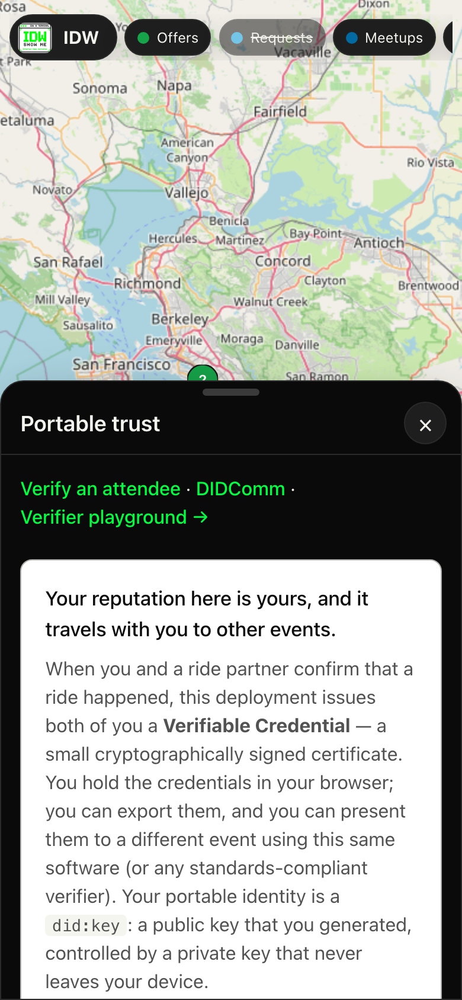</p>

<table>
  <tr>
    <td width="50%">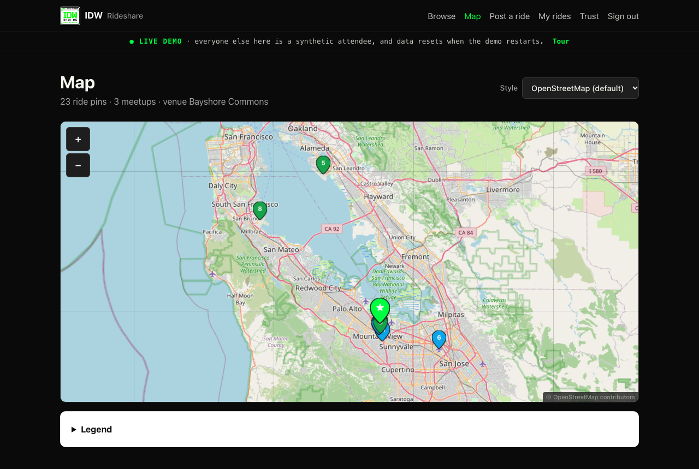</td>
    <td width="50%">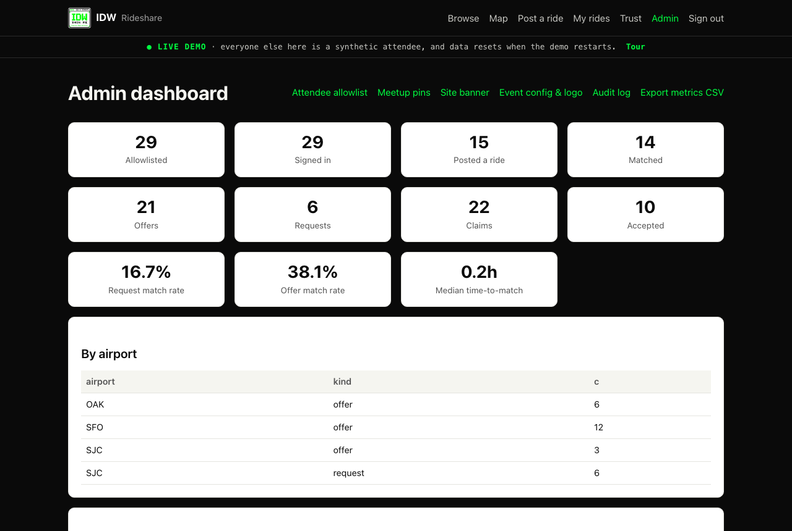</td>
  </tr>
</table>

## Quick start

Requires Node.js 22.5+ (for built-in `node:sqlite`; stable in Node 24+) and an email provider: [Resend](https://resend.com) (free tier) or any SMTP server.

```bash
git clone https://github.com/dcondrey/rideshare.git
cd rideshare
cp .env.example .env
```

Edit `.env`:

```bash
# Paste each output into .env:
openssl rand -hex 32    # SESSION_SECRET
openssl rand -hex 32    # ALLOWLIST_SALT

# Then set:
#   ADMIN_EMAILS=you@example.com
#   RESEND_API_KEY=re_xxx  (or SMTP_* vars)
#   EMAIL_FROM="Rideshare <noreply@yourdomain.com>"
```

```bash
npm start      # http://localhost:3000
npm run dev    # auto-reload
```

Then:

1. Sign in at `http://localhost:3000` with your admin email.
2. Upload your attendee CSV at `/admin/allowlist`, or run `npm run allowlist:import -- attendees.csv`.
3. Set up the event at `/admin/config` or in `event.config.yaml`.
4. Share the URL.

For a dry run, `node scripts/seed-demo.js --yes` fills the app with fake attendees, rides and claims. It refuses to touch a database with real signups.

## Deploy

### Docker

```bash
cp .env.example .env    # edit with your values
docker compose up -d
```

SQLite lives in the `rideshare-data` named volume. Back it up with:

```bash
docker run --rm -v rideshare-data:/data -v $PWD:/out alpine \
  tar czf /out/backup.tgz /data
```

### Render

Push to GitHub, then in Render choose New > Blueprint and point it at the repo. `render.yaml` provisions the service and a 1GB disk for SQLite, and prompts for secrets.

For a public demo, set the Blueprint path to `render.demo.yaml` instead. Nothing to fill in: the URL comes from `RENDER_EXTERNAL_URL`, secrets are generated, and the issuer becomes `did:web:<service>.onrender.com`. The free plan has no disk and sleeps when idle, so each wake-up is a fresh demo.

### Railway

Add a Volume mounted at `/data`. Set `APP_URL=https://your-app.up.railway.app`, `SESSION_SECRET` and `ALLOWLIST_SALT` (32-byte hex; Railway can generate them), `ADMIN_EMAILS`, `RESEND_API_KEY`, `EMAIL_FROM` and `TRUST_PROXY=true`.

### Fly.io

```bash
fly launch --copy-config --name your-app
fly volumes create data --size 1 --region iad
fly secrets set \
  SESSION_SECRET=$(openssl rand -hex 32) \
  ALLOWLIST_SALT=$(openssl rand -hex 32) \
  ADMIN_EMAILS=you@example.com \
  RESEND_API_KEY=re_xxx \
  EMAIL_FROM='"Rideshare <noreply@yourdomain.com>"' \
  APP_URL=https://your-app.fly.dev \
  TRUST_PROXY=true
fly deploy
```

Any VPS works too: one Node process and a persistent directory for the database and key.

## Configuration

Event settings live in `event.config.yaml`. Start from the template:

```bash
cp event.config.example.yaml event.config.yaml
```

`event.config.example.yaml` is the commented template. Your copy is gitignored. Without it the app boots from the example and warns on every start. JSON (`event.config.json`) also works, and most fields can be changed live at `/admin/config`.

The file is validated at boot. An unknown key, missing required field, reversed date range or out-of-range coordinate stops the process with every problem and its path.

**Logo.** Upload at `/admin/config` (stored in the DB, max 200KB, PNG/WebP/JPEG, served from `/logo`), or put a file in `public/` and set `brand.logoPath: /static/<file>`. The upload wins. The logo also shows above the event name on the landing page.

**Theme.** `brand.primaryColor` sets the accent; dark mode is automatic. For more, set `brand.stylesheet: /static/<file>.css` to a file in `public/`. It loads after the built-in CSS and can override any custom property. `public/idw-theme.css` (the demo's black, white and phosphor-green theme) is an example.

**Map styles.**

| Style | Look | API key |
|---|---|---|
| `osm` (default) | Classic OpenStreetMap | No |
| `voyager` | Flat retro warm palette (CARTO) | CARTO key |
| `positron` | Bright minimal grayscale (CARTO) | CARTO key |
| `dark-matter` | Dark retro (CARTO) | CARTO key |
| `toner-lite` | Black and white (Stadia) | Stadia key off localhost |
| `custom` | Your own tile URL | Depends on provider |

CARTO now returns an "API key required" placeholder tile to keyless requests, hence the `osm` default. Tiles are requested with the page origin as `Referer`, per the OpenStreetMap tile usage policy. A busy event should use its own provider: for Mapbox, MapTiler and the like, choose `custom` and set `map.customTileUrl` and `map.customAttribution`.

Riders pin pickup by choosing a meetup spot, entering coordinates, or defaulting to the airport.

### Importing attendees

At `/admin/allowlist`, upload or paste a CSV: a single email column, or any file with an `email` header. Choose Replace or Append.

The CSV is never written to disk. Each email is normalized (lowercase, trimmed, Gmail dots and plus-tags stripped) and stored as `HMAC-SHA256(email, ALLOWLIST_SALT)`.

### Environment variables

| Variable | Required | Default | Description |
|---|---|---|---|
| `APP_URL` | Yes | | Public URL. On Render, defaults to `RENDER_EXTERNAL_URL` |
| `SESSION_SECRET` | Yes | | 32-byte hex; signs sessions and magic links |
| `ALLOWLIST_SALT` | Yes | | 32-byte hex; HMAC key for attendee emails |
| `ADMIN_EMAILS` | Yes | | Comma-separated admin emails |
| `EMAIL_FROM` | Yes | | RFC 5322 sender, e.g. `"Rideshare <noreply@x.com>"` |
| `RESEND_API_KEY` | One of | | [Resend](https://resend.com) API key |
| `SMTP_HOST`, `SMTP_PORT`, `SMTP_USER`, `SMTP_PASS`, `SMTP_SECURE` | One of | | Bring-your-own SMTP |
| `SMTP_ALLOW_PLAINTEXT` | No | `false` | Waives the STARTTLS requirement. Local no-TLS relays only |
| `PORT` | | `3000` | HTTP port |
| `DATABASE_PATH` | | `./data/app.db` | SQLite file |
| `TRUST_PROXY` | | `false` | `true` behind a reverse proxy |
| `MAGIC_LINK_RATE_LIMIT` | | `5` | Sign-in emails per address per hour |
| `SESSION_LIFETIME_DAYS` | | `14` | Session cookie lifetime |
| `DEPLOYMENT_KEY_PATH` | | `./secrets/deployment.key` | Issuer key file, created on first boot. Back it up separately from the database |
| `DEPLOYMENT_KEY` | | | Key file contents inline, for hosts without a persistent disk. Overrides the path |
| `EVENT_CONFIG` | | | Config file to load instead of `event.config.yaml`, e.g. `event.config.demo.yaml` |
| `DEMO_MODE` | | `false` | One-click demo accounts and synthetic attendees. Never on a real event |
| `ALLOW_INSECURE_DID_WEB` | | `false` | Lets `did:web` resolve over plain HTTP for `localhost` only, for local cross-deployment testing |

## Operations

```bash
npm run backup
```

Snapshots with SQLite's `VACUUM INTO` while serving, checks with `PRAGMA integrity_check`, prunes past `RETENTION_DAYS` (default 30). Restore and cadence: [RUNBOOK.md](RUNBOOK.md#backup-procedure).

After the event, use Allowlist > Wipe attendee data, or delete the SQLite file to remove everything. To update, pull and restart; migrations are additive (`CREATE TABLE IF NOT EXISTS`, additive `ALTER`).

Troubleshooting and the operator checklist: [RUNBOOK.md](./RUNBOOK.md).

## Why zero dependencies

No `node_modules`, no supply chain, no build step, nothing to bump. The attack surface is this repo and Node.

The cost is hand-rolled code: SMTP client, YAML parser, map renderer, QR encoder, SD-JWT, OpenID4VC and DIDComm. Each is tested against an independent reference where one exists: RFC 8032 and RFC 9901 vectors, the DIDComm spec vector and didcomm-rust, python-qrcode matrices, and the XChaCha draft vector.

For a guided read of the source, see [docs/code-reading-guide.md](./docs/code-reading-guide.md).

## Security

- The invite allowlist is stored only as HMAC-SHA256 hashes. Signed-in users' addresses are plaintext (`users.email`, `magic_links.email`) because the app mails them, so treat the database and backups as holding attendee addresses.
- Magic-link endpoints respond the same for on-list and off-list emails and are rate-limited per email and IP.
- No third-party JS, fonts, trackers or analytics. CSP `default-src 'self'`, HSTS, SameSite cookies.
- Constant-time secret comparison, parameterized SQL, revocable server-side sessions, and an audit log of admin and sensitive actions.

Policy and disclosure: [SECURITY.md](./SECURITY.md). STRIDE analysis: [THREAT_MODEL.md](./THREAT_MODEL.md).

## Limitations

- Single instance. SQLite and the in-memory rate limiter rule out multiple replicas. One small instance handles a few thousand users.
- Pages are server-rendered. Live positions use SSE, and there is no background location: sharing stops when you close or leave the page.
- The SMTP client supports PLAIN/LOGIN auth and STARTTLS (Postmark, SES, Mailgun, Gmail). For XOAUTH2-only providers, use Resend.
- `node:sqlite` is experimental in Node 22 (warning suppressed) and stable in Node 24+.

What's deliberately left out (payments, OAuth, real-time chat, native app) and why: [docs/intentional-non-features.md](./docs/intentional-non-features.md).

## Contributing

See [CONTRIBUTING.md](./CONTRIBUTING.md).

## License

MIT. See [LICENSE](./LICENSE).
